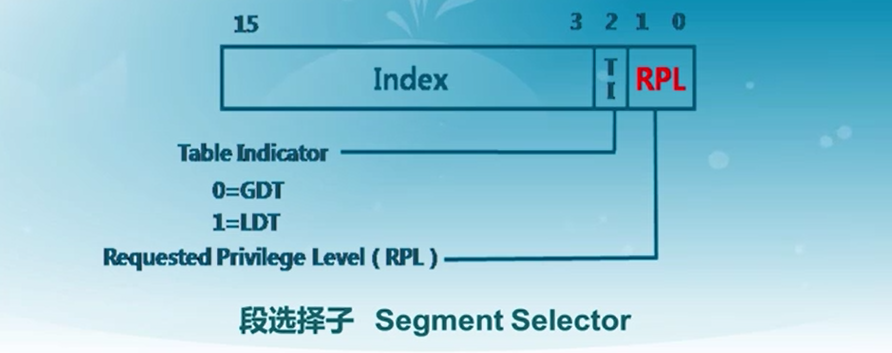

- 概念解释
	- 选择子（Segment Selector)
		- 有两个描述符表，GDT（全局描述符表）和LDT
		- GDT是一个段描述符数组，起始地址存在全局描述符寄存器（GDTR）中，
		  GDTR长48位，高32为基地址，低16位位段界限
		- 描述符表中有8192个描述符
		- {:height 252, :width 616}
		- 段选择子的结构包括三部分，索引、表指示位、请求特权级别
		- 索引包括13位（能索引8192个）
		- 选择子的作用？
			- 定位到一个段描述符
	- 段描述符
		- 为什么有段描述符？
		- 如何从逻辑地址转换为物理地址？
			- 分成两步：分段地址转换 和 分页地址转换
			- 分段地址转换：虚拟地址（逻辑地址）中包含段选择子和段偏移，段选择子可以定位到一个段描述符，结合段描述符中的段基址加上段偏移就能得到线性地址
			- 分页地址转换：把线性地址转换为物理地址（HOW？）
	- 实模式下的地址计算方法
		- 16*段寄存器值+段内偏移地址